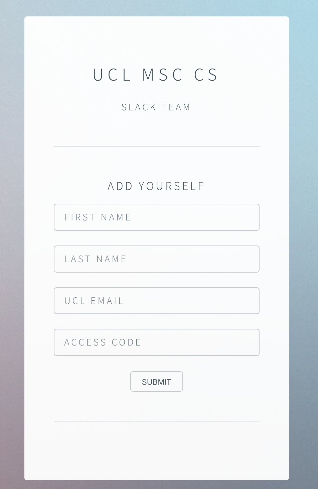

# Slack Inviter
## A Simple Webapp to Facilitate Slack Sign-Ups

This simple Python webapp is build on the Bottle micro-framework and a template from HTML5UP.

Simply build a config file, provide your teammates with a sign-up key, and launch the webapp.

The web UI looks like this:

## Config File Layout

'''json
{
	"token":"YOUR_SLACK_API_TOKEN",
	"key":"A_CUSTOM_KEY"
	}
'''

## Running

`cd` into the directory where you find `index.py` and run the command:  
`nohup python index.py &`  
and press `Return` twice. This will launch the web server on port 9009.  
If testing on a local system, navigate in your browser to `http://localhost:9009`. Otherwise, navigate to `http://YOUR_SERVER_IP_ADDRESS:9009`.

## Compatibility

This has been tested on OS X and Debian. It might be compatible on other systems, I just haven't tested them.
